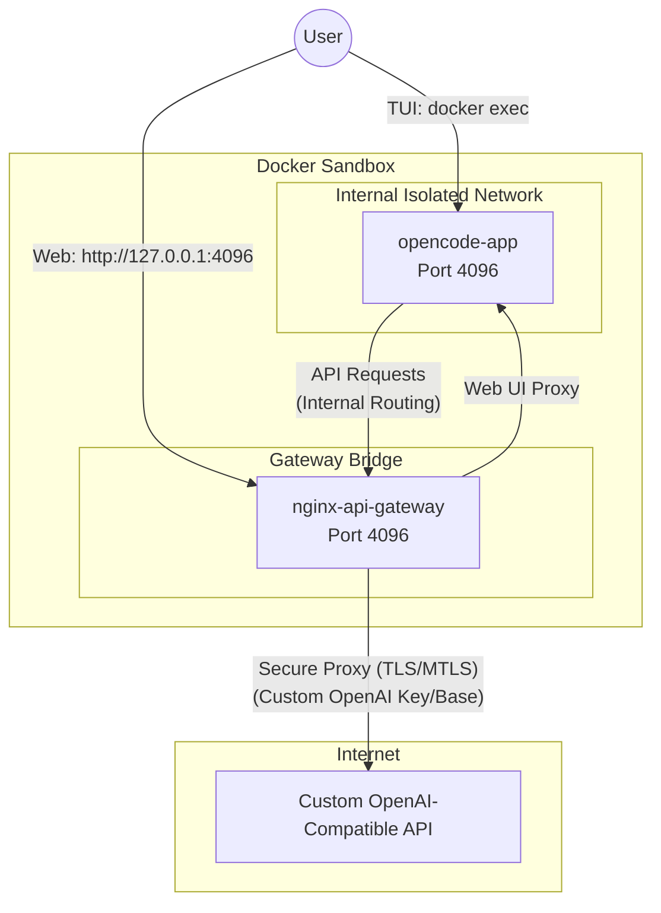

# opencode-web-openai-docker-sandbox

A secure way to run OpenCode Web with any OpenAI-compatible provider in a container until official Docker Sandbox support is added.

### Architecture



### Key Features
- **Network Isolation:** `opencode-app` has no direct internet access.
- **Secure Proxy:** `nginx-api-gateway` handles external communication, prevents header leaks, and enforces a 1M request limit.
- **Environment Safety:** API keys are managed by `nginx-api-gateway` and isolated from `opencode-app`.
- **Custom Provider Support:** Easily use any OpenAI-compatible endpoint (Self-hosted, Groq, Mistral, etc.).
- **Volume Mounting:** Expose your project via `PROJECT_DIR`.

### Quick Start
1. **Set your API Configuration:**
   ```bash
   # Required: Your API Key
   export OPENAI_API_KEY=your_key_here

   # Required: The full base URL of your provider (including trailing slash)
   # Example for Groq: https://api.groq.com/openai/v1/
   export OPENAI_API_BASE=https://api.yourprovider.com/v1/
   ```
2. **Launch the Sandbox:**
   ```bash
   # PROJECT_DIR: The directory of YOUR project that you want OpenCode to work on
   export PROJECT_DIR=/path/to/your/project
   docker-compose down
   docker-compose up -d
   ```
3. **Access opencode-app:**
   - **Web:** http://127.0.0.1:4096/
   - **TUI:**
     ```bash
     docker exec -it opencode-app opencode --model 'openai/your-model-name'
     ```

---

## Optional: Toggling the Air Gap

**The air gap is enabled by default** - the sandbox is secure out of the box with no additional configuration needed.  
This section is only for advanced users who would want to toggle the air gap off, and then back on again.

> [!WARNING]
> Removing the air gap grants the AI assistant direct internet access.
> Only do this if you trust the AI model and understand the security implications.
>
> LLM API requests will still be routed securely through the NGINX gateway.

**Remove Air Gap (Grant Internet Access):**
```bash
docker network connect opencode-web-openai-docker-sandbox_internet_access opencode-app
```

**Restore Air Gap (Revoke Internet Access):**
```bash
docker network disconnect opencode-web-openai-docker-sandbox_internet_access opencode-app
```

**Verify Network Status:**
```bash
docker inspect opencode-app --format='{{range $net, $conf := .NetworkSettings.Networks}}{{$net}} {{end}}'
```
